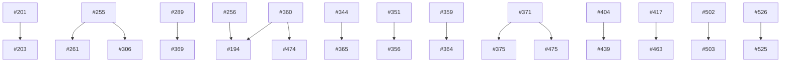

# Open-issue adversarial corpus — 2026-09-04

Dated snapshot of **40 open GitHub issues** reviewed against current `main` at `f9ff32c933020e267f5560493f4739538d2b95f6`.
**Sources of truth:** GitHub issue bodies/comments/labels and [`docs/design/implementation-roadmap.md`](../../../design/implementation-roadmap.md).
This directory holds **review evidence** (verdicts, measurements, disposition criteria) — not authoritative requirements.

## Verdict taxonomy

| Verdict | Meaning |
|---------|---------|
| `valid-now` | Actionable on current main; evidence confirms defect or agreed work |
| `valid-slice` | Partly actionable; remainder blocked on decision, signal, or dependency |
| `blocked-signal` | Correct direction; waiting on production data, pilot, or wiring |
| `blocked-operator` | Owner/console action only |
| `blocked-decision` | Needs owner semantics or design choice before code |
| `duplicate` | Superseded by another issue in this corpus |
| `refuted` | Named mechanism or premise refuted by measurement (issue may still be open) |
| `stale-fixed` | (none in this snapshot) |
| `meta-board` | Tracking/infra board, not a single code PR |
| `external` | Wrong repo or deployment operator scope |

## Disposition summary

- **valid-now:** [#256](./256.md), [#257](./257.md), [#264](./264.md), [#350](./350.md), [#351](./351.md), [#356](./356.md), [#360](./360.md), [#369](./369.md), [#439](./439.md), [#494](./494.md), [#522](./522.md), [#523](./523.md), [#526](./526.md)
- **valid-slice:** [#342](./342.md), [#474](./474.md), [#475](./475.md), [#477](./477.md), [#514](./514.md), [#515](./515.md)
- **blocked-signal:** [#201](./201.md), [#261](./261.md), [#306](./306.md), [#364](./364.md), [#365](./365.md), [#371](./371.md), [#375](./375.md), [#503](./503.md)
- **blocked-decision:** [#194](./194.md), [#200](./200.md), [#202](./202.md), [#203](./203.md), [#463](./463.md), [#476](./476.md), [#502](./502.md)
- **blocked-operator:** [#250](./250.md)
- **duplicate:** [#525](./525.md)
- **refuted:** (none)
- **meta-board:** [#275](./275.md), [#405](./405.md), [#478](./478.md)
- **external:** [#208](./208.md)

## Waves (execution order)

- **W0-external:** #208
- **W0-meta:** #275, #405, #478
- **W0-ops:** #250
- **W1-ci:** #350, #351, #356, #522, #523, #525, #526
- **W2-api:** #439
- **W2-docs:** #257, #494
- **W2-learning:** #264
- **W2-mutate:** #360, #369
- **W2-stores:** #256
- **W3-llm:** #514, #515
- **W4-mutate:** #474
- **W4-retrieval:** #463, #475, #476, #477, #502
- **W4-security:** #194
- **W5-learning:** #261, #342
- **W5-ops:** #364, #365
- **W5-retrieval:** #371, #375, #503
- **W5-workers:** #306
- **W6-query-history:** #200, #201, #202, #203

## File-territory collision map

| Territory | Issues |
|-----------|--------|
| `tests/`, CI workflows | #526, #525, #356, #351, #350, #523, #522 |
| `src/trellis_cli/` | #522, #494 |
| `src/trellis/retrieve/` | #439, #503, #502, #475, #477, #371, #375, #463 |
| `src/trellis/mutate/` | #360, #369, #474, #194 |
| `src/trellis/llm/` | #514, #515 |
| `src/trellis/stores/` | #350, #351, #256 |
| `src/trellis/learning/` | #264, #342, #261, #502 |
| `docs/design/` | #257, #478, #200, #202, #275 |
| Ops / external | #405, #250, #208, #365 |
| Query-history (pilot) | #200, #201, #202, #203 |

## Dependency graph

Edges follow [`manifest.json`](./manifest.json) `dependencies` only: **prerequisite → dependent**.
Sequencing/collision notes live in individual briefs, not here.

## Execution / merge gates

1. **Green against current `main`** — rebase before merge; no stale SHA claims.
2. **Territory collision** — issues sharing a territory should not dispatch in parallel without coordination (#526 + #356 both touch CI).
3. **Split consensus stops** — blocked-decision issues require owner call before implementation PRs.
4. **Valid-slice discipline** — ship only the named slice; defer blocked halves explicitly.
5. **Disposition acceptance** — each brief defines independently testable close/reopen criteria.
6. **JSON manifest** — [`manifest.json`](./manifest.json) is the machine index; GitHub issues remain authoritative.

## Files

- [`manifest.json`](./manifest.json) — machine-readable index
- `#NNN.md` — one review brief per issue (40 files)
